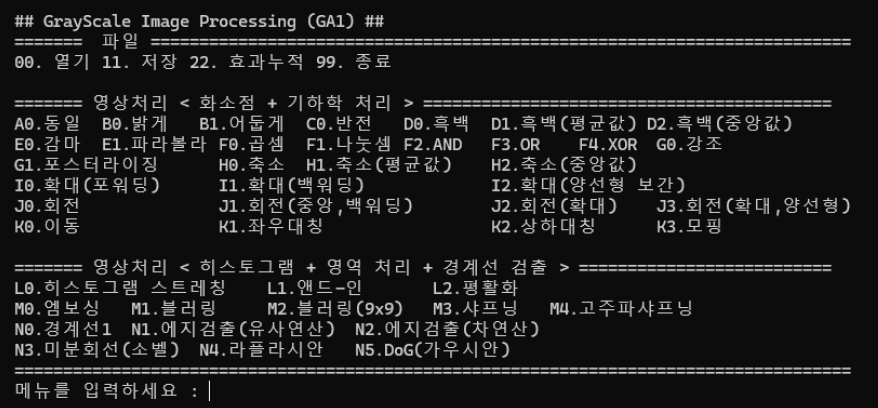
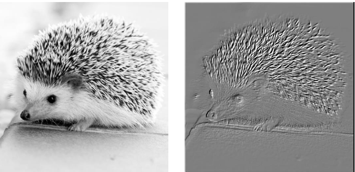

# GrayScale Image Processing

## Purpose
- Open CV 없이 C 언어로 영상 처리
- Command 기반 입력 처리

## Development Environment
- Visual Studio 2022, Windows 11, C

## Function
- 파일 : 열기, 저장 , 효과 누적
- 화소점 처리 : 15 가지  
  기하학 처리 : 13 가지 
  히스토그램 처리 : 3 가지 
  화소 영역 처리 : 4 가지  
 경계선 검출 : 6 가지   
  

